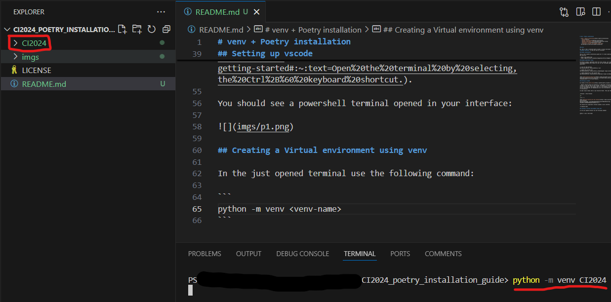

# venv + Poetry installation

- [venv + Poetry installation](#venv--poetry-installation)
  - [Intro](#intro)
  - [Python installation](#python-installation)
  - [Windows powershell setup](#windows-powershell-setup)
  - [Virtual environment](#virtual-environment)
    - [Setting up vscodeS](#setting-up-vscodes)
    - [Creating a Virtual environment using venv](#creating-a-virtual-environment-using-venv)
    - [Activate the environment](#activate-the-environment)
  - [Install poetry](#install-poetry)
    - [Downalod the .toml file for the course](#downalod-the-toml-file-for-the-course)
    - [Configure poetry](#configure-poetry)
  - [jupyter](#jupyter)
    - [Create jupyter notebook](#create-jupyter-notebook)
    - [Select the interpreter](#select-the-interpreter)


## Intro

Hi, this is how I installed poetry inside a virtual environment in my **windows machine**. It may not work for everyone!  

> This guide is intended for those taking the Computational Intelligence 24/25 course at Turin Polytechnic.

## Python installation

This is not a python installation guide but I'll leave some resources that may help you:

- https://www.python.org/
- https://apps.microsoft.com/detail/9pjpw5ldxlz5?hl=en-US&gl=US

## Windows powershell setup

By default windows' powershell does not allow running .ps1 scripts. To list/enable/disable this feature we can run the following commands on the powershell:

```
// list all the policies
Get-ExecutionPolicy -ExecutionPolicy -List         

// enable the current user                     
Set-ExecutionPolicy -ExecutionPolicy RemoteSigned -Scope CurrentUser    

// remove permission to the current user
Set-ExecutionPolicy -ExecutionPolicy Undefined -Scope CurrentUser       
```

check [about_Execution_Policies](https://learn.microsoft.com/it-it/powershell/module/microsoft.powershell.core/about/about_execution_policies?view=powershell-7.4) for more details.

## Virtual environment
As stated in the [poetry docs](https://python-poetry.org/docs/):

> *Poetry should always be installed in a dedicated virtual environment to isolate it from the rest of your system. It should in no case be installed in the environment of the project that is to be managed by Poetry. This ensures that Poetry’s own dependencies will not be accidentally upgraded or uninstalled.*


### Setting up vscodeS

So open visual studio code in your desired folder. Then open the terminal


>Terminal -> New Terminal
>
>or
>
>ctrl + ò

Check [Getting started with the terminal](https://code.visualstudio.com/docs/terminal/getting-started#:~:text=Open%20the%20terminal%20by%20selecting,the%20Ctrl%2B%60%20keyboard%20shortcut.).

You should see a powershell terminal opened in your interface:


### Creating a Virtual environment using venv

> ⚠️ for the following step always remain in the yor working folder.

In the just opened terminal use the following command:

```
python -m venv <venv-name>
```

A new folder with `<venv-name>` should appear:



Check [venv — Creation of virtual environments](https://docs.python.org/3/library/venv.html) for more info.

### Activate the environment

In the terminal write:

```
.\<your-venv>\Scripts\Activate.ps1
```

to activate the environment


> to exit from the environment just type
>
> ```
> deactivate
> ```

## Install poetry

While **having the venv activated**, use pip to install poetry:

```
pip install poetry
```

### Downalod the .toml file for the course

To configure the project we need the .toml file with all the required packacges. We can use the one in [Professor Squillero's Repository]([2024-25/pyproject.toml](https://github.com/squillero/computational-intelligence/blob/master/2024-25/pyproject.toml)).
Download the file and put it inside your project folder (NOT inside the venv folder).

```
.
└── ProjectFolder/
    ├── <your-venv>/
    │   ├── Include/
    │   ├── Lib/
    │   ├── Scripts/
    │   └── pyvenv.cfg
    ├── <your-project-files>
    └── pyproject.toml
```

### Configure poetry

Now we can run the following command to tell poetry to use the .toml file to download all the required packages:

```
peotry install
```

It will take some time to downalod all the files. You can check in `<your-venv>/Lib/` if the packages and dependencies are correctly installed.

After installation you're good to go!

## jupyter

To conclude this guide let's create a notebook and set the new envirnoment we created as the running one.

### Create jupyter notebook

Create a .ipynb file in your folder and then open it.

### Select the interpreter

In the top right corner of the file view we can see a "select kernel" button. 


Click it and a pop up dialg window should appear. Click Python Environment


Then select your newly created environment


You're all done now! Try some code and che if all the file works.